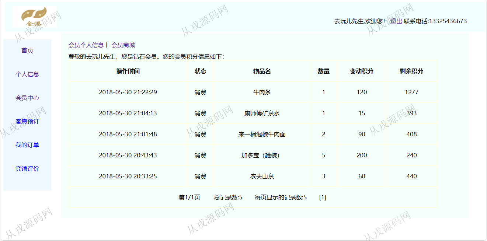
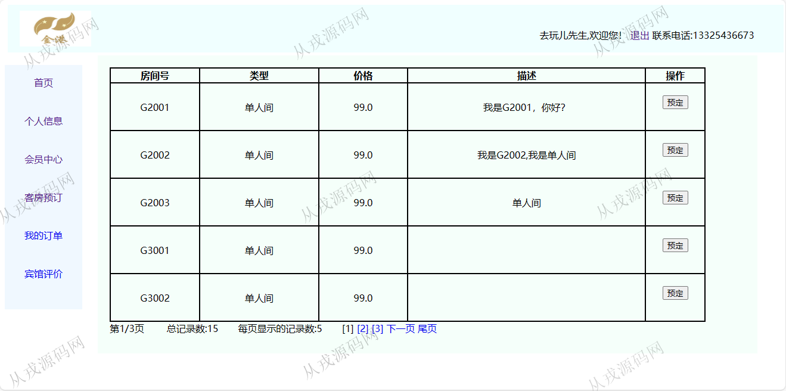
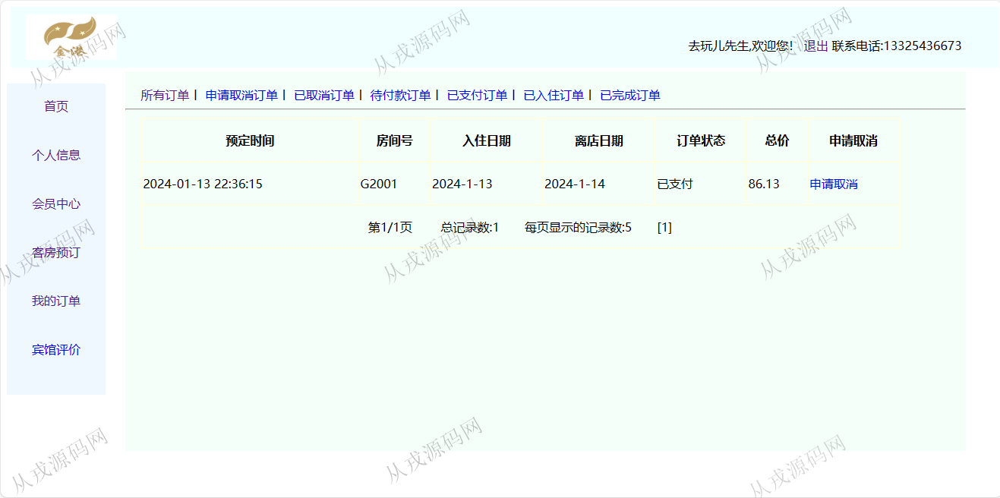
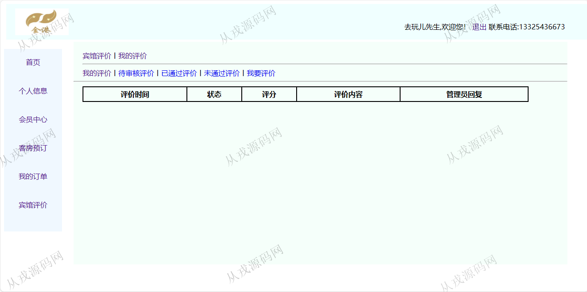
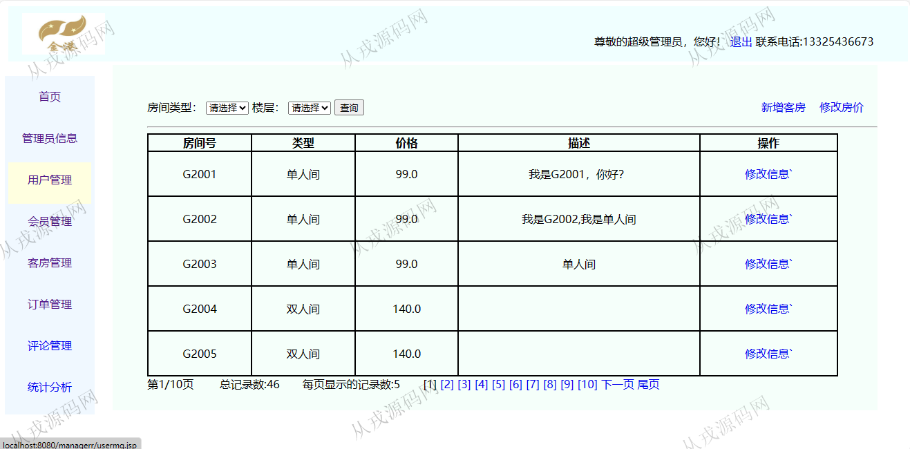
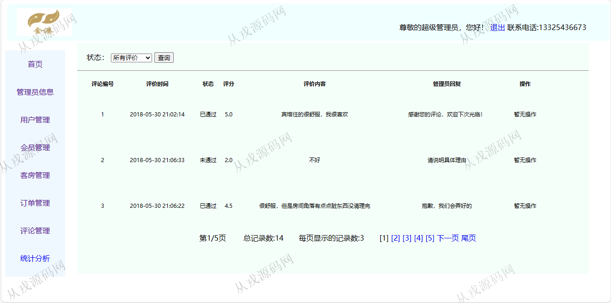
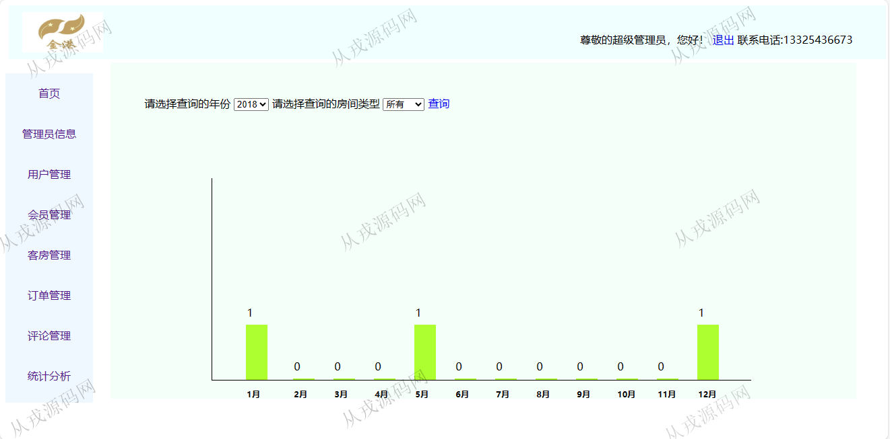
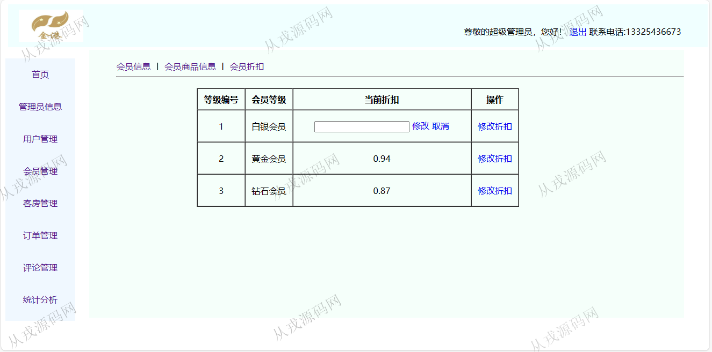

<h1 align="center">152.金港宾馆管理系统</h1>

 获取sql文件 QQ: 386869957 QQ群: 377586148 

 [更多源码项目: 从戎源码网](https://armycodes.com/) 

## 简介

> 本代码来源于网络,仅供学习参考使用!
>
> 提供1.远程部署/2.修改代码/3.设计文档指导/4.框架代码讲解等服务
> 
> 后端访问地址: http://localhost:8080/managerr/login.jsp
> supadmin  123456
> 
> 前端访问地址: http://localhost:8080/jsp/login.jsp
> 18616959966 12345678
> 

## 项目介绍
基于ssm的金港宾馆管理系统：前端 jsp、jquery，后端 springmvc、spring、mybatis；角色分为管理员、用户；集成客服预定、宾馆评价、我的订单等功能于一体的系统。

## 功能介绍

### 用户
 
- 基本功能：登录，注册，退出
- 个人信息：个人信息查看与修改
- 会员中心：会员积分信息列表查询，会员商城购买商品（积分兑换商品）
- 客房预订：选择入住时间和退房时间，选择房型，查询推荐房间，在线预定
- 我的订单：所有订单丨 申请取消订单丨 已取消订单丨 待付款订单丨 已支付订单丨 已入住订单丨 已完成订单 ，申请取消
- 宾馆评价：评价列表查询
- 我的评价：待审核评价丨已通过评价丨未通过评价丨我要评价

### 管理员

- 管理员管理：管理员信息的增删改查，密码修改，超级管理员信息只能查看不允许修改
- 用户管理：用户在前台系统自行注册，管理员可以查看用户信息和修改，对会员进行升级
- 客房管理：客房信息的增删改查，修改房价，条件查询
- 订单管理：订单列表查询，入住、取消、完成操作
- 评价管理：对用户在前台的评价信息进行查询和审核
- 统计分析：根据年份和房间类型查询统计信息

## 环境

- <b>IntelliJ IDEA 2021.3</b>

- <b>Mysql 5.7.26</b>

- <b>Tomcat 7.0.73</b>

- <b>JDK 1.8</b>

## 运行截图

